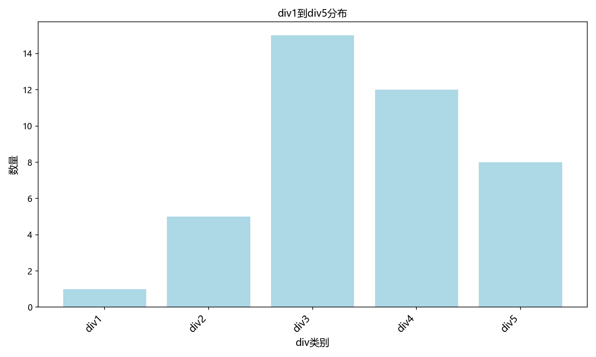
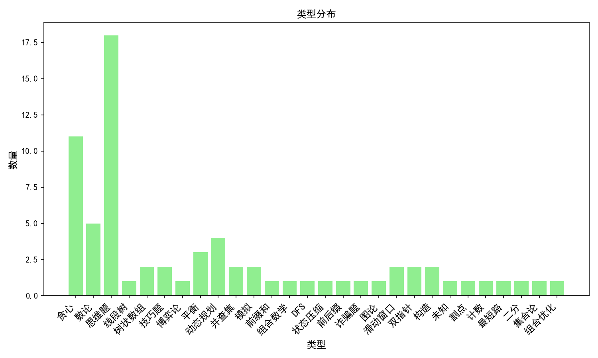
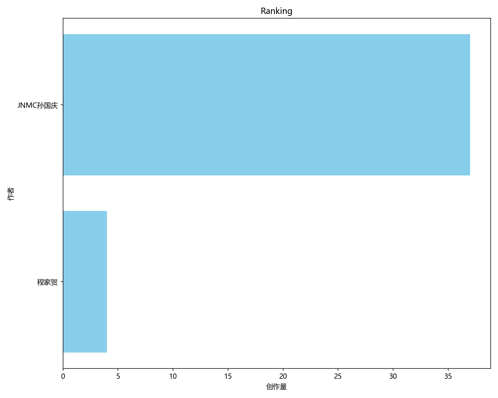

**Made by Sungq Liyk and Chengjh**

#### `C++/python/java` 刷题训练营
---
# **训练平台**
目标未达，你会不会在自己头上放一把刀呢?

---

# 题单:
**刷完差不多有XCPC铜牌水平**
[牛客算法入门题单](https://ac.nowcoder.com/discuss/817596)
### [算法可视化](https://www.cs.usfca.edu/~galles/visualization/Algorithms.html)

---

# 平台模块
## [基础理论学习](基础理论学习/README.md)
## [算法与代码学习](算法/README.md)
## [刷题训练](周赛补题/README.md)

---

# 刷题训练数据

---

