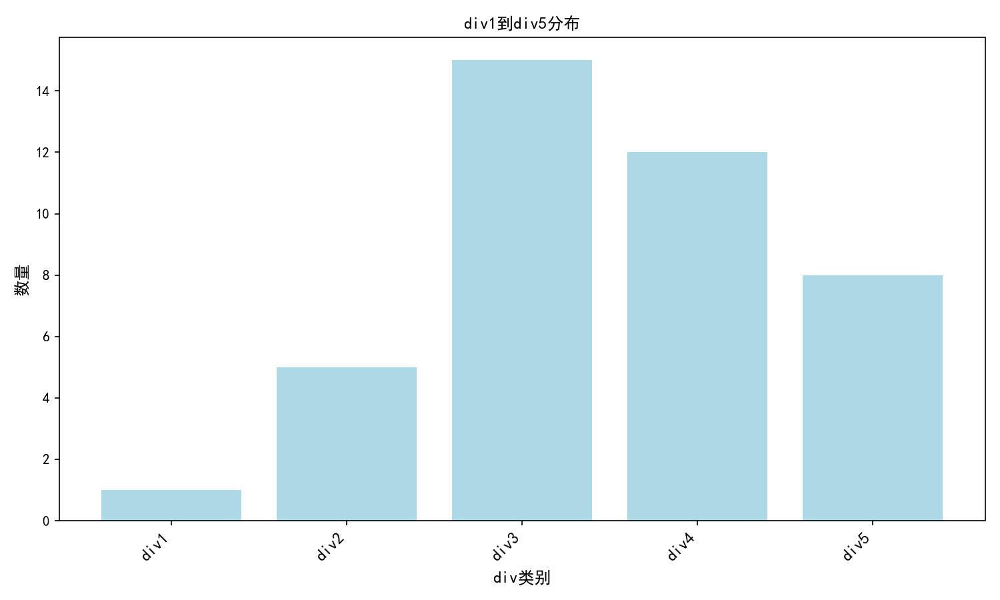

**Made by Sungq Liyk and Chengjh**
 
# 算法 C++ 
# **个人的力量是有限的，但团队的力量是无限的**

## 题单:
**刷完差不多有XCPC铜牌水平**
[牛客算法入门题单](https://ac.nowcoder.com/discuss/817596)
### [算法可视化](https://www.cs.usfca.edu/~galles/visualization/Algorithms.html)

### 刷题训练数据

