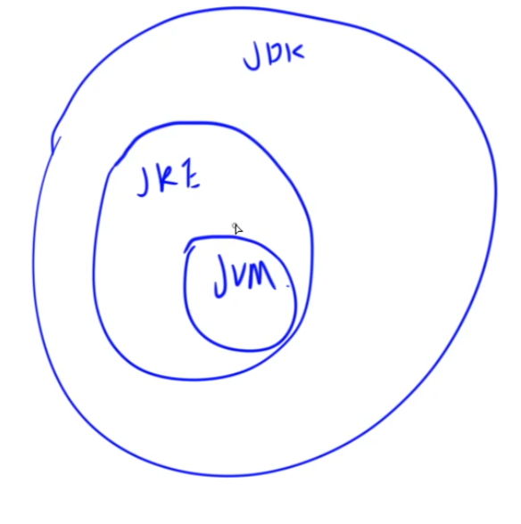

# 基本概念



## JVM

JVM：Java Virtual Machine，Java虚拟机  
jvm是java解释器，java代码会生成字节码，字节码会由jvm解释执行

## JRE

JRE: Java Runtime Environment，Java运行环境  
JRE是java运行环境，包含jvm和java核心类库

## JDK

JDK：Java Development Kit，Java开发工具包  
JDK是java开发工具包，包含jre和开发工具

## JSE、JEE、JME的区别

JSE: Java Standard Edition，标准版  
JEE：Java Enterprise Edition，企业版  
JME: Java Mirco Edition，移动版  
Spring是JEE的轻量级替代品  
SpringBoot是Spring + 自动化配置  

# java语法

## 1.变量、运算符、输入与输出

类似于`C#`，`Java`的所有变量和函数都要定义在`class`中。

### 1.1内置数据类型


| 类型    | 字节数 | 举例                |
|-------|------|-------------------|
| byte  | 1    | 123               |
| short | 2    | 12345             |
| int   | 4    | 123456789         |
| long  | 8    | 1234567891011L    |
| float | 4    | 1.2F              |
| double| 8    | 1.2, 1.2D         |
| boolean| 1   | true, false       |
| char  | 2    | ‘A’               |

### 1.2常量

使用`final`修饰：

```JAVA
final int N = 110;
```

### 1.3 类型转化

显示转化：`int x = (int)'A';`  
隐式转化：`double x = 12, y = 4 * 3.3;`  
显示转化可以将高精度转化为低精度，隐式转化只能将低精度转化为高精度。

### 1.4 表达式

与C++、Python3类似：

```JAVA
int a = 1, b = 2, c = 3;
int x = (a + b) * c;
x ++;
```

### 1.5 输入

方式1，效率较低，输入规模较小时使用。

```JAVA
Scanner sc = new Scanner(System.in);
String str = sc.next();  // 读入下一个字符串
int x = sc.nextInt();  // 读入下一个整数
float y = sc.nextFloat();  // 读入下一个单精度浮点数
double z = sc.nextDouble();  // 读入下一个双精度浮点数
String line = sc.nextLine();  // 读入下一行
```

方式2，效率较高，输入规模较大时使用。注意需要抛异常。

```JAVA
package com.yxc;

import java.io.BufferedReader;
import java.io.InputStreamReader;

public class Main {
    public static void main(String[] args) throws Exception {
        BufferedReader br = new BufferedReader(new InputStreamReader(System.in));
        String str = br.readLine();
        System.out.println(str);
    }
}
```

### 1.6 输出

方式1，效率较低，输出规模较小时使用。

```JAVA
System.out.println(123);  // 输出整数 + 换行
System.out.println("Hello World");  // 输出字符串 + 换行
System.out.print(123);  // 输出整数
System.out.print("yxc\n");  // 输出字符串
System.out.printf("%04d %.2f\n", 4, 123.456D);  // 格式化输出，float与double都用%f输出
```

方式2，效率较高，输出规模较大时使用。注意需要抛异常。

```JAVA
package com.yxc;

import java.io.BufferedWriter;
import java.io.OutputStreamWriter;

public class Main {
    public static void main(String[] args) throws Exception {
        BufferedWriter bw = new BufferedWriter(new OutputStreamWriter(System.out));
        bw.write("Hello World\n");
        bw.flush();  // 需要手动刷新缓冲区
    }
}
```

## 2.判断语句

