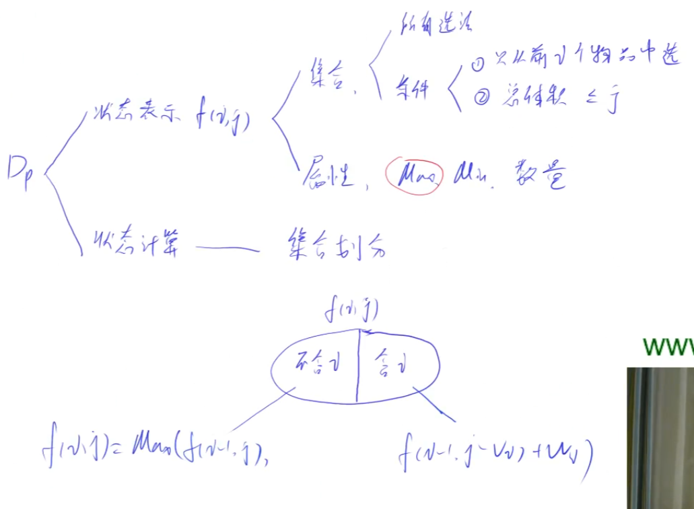

# 01背包

## 什么是01背包

**每件物品仅用一次**



### 朴素版
```C++
  for(int i=1;i<=n;i++)
     for(int j=0;j<=m;j++)
     {
         dp[i][j]=dp[i-1][j];
         if(j>=v[i])dp[i][j]=max(dp[i][j],dp[i-1][j-v[i]]+w[i]);
     }
```
### 优化版
  
  将二维dp优化为一维dp  
  j从m开始的原因  
   如果**从v[i]开始，j和j-v[i]都是小于等于j的 第二层for循环中，dp[j]和dp[j-v[i]]是被不断更新的** 
  也就是说一直用的都是dp[i][j]和dp[i][j-v[i]]，而没用dp[i-1]  
  但是如果**从m开始，j-v[i]此时还没有被更新，也就是dp[i-1]的结果**  
  那么这样就满足我们的要求了   
```C++
  for(int i=1;i<=n;i++)
    for(int j=m;j>=v[i];j--)
    dp[j]=max(dp[j],dp[j-v[i]]+w[i]);
```

# 完全背包

**每件物品可用无限次**
```C++
#include<bits/stdc++.h>
using namespace std;

const int N=1010;

//int dp[N][N];
int dp[N];
int n,m;
int w[N],v[N];
int main()
{
    cin>>n>>m;
    for(int i=1;i<=n;i++) cin>>v[i]>>w[i];
    
    for(int i=1;i<=n;i++)
    {
        
            /* 
          for(int j=0;j<=m;j++)
        {  
            for(int k=0;v[i]*k<=j;k++)
            {
                //最朴素版
                //dp[i][j]代表1-i中随便选
                //dp[i-1][j-v[i]*k]+k*w[i]代表必须选i然后选k个i
                //比较那个更好
                //注：当k等于0的时候，就是比较dp[i,j]和dp[i-1,j]
                dp[i][j]=max(dp[i][j],dp[i-1][j-v[i]*k]+k*w[i]);
            }
        }  
            */
            
           
            /*    
            //第一次优化
            //由递归公式
                //一个都不选，选一个，两个…… 看那个更大
            //dp[i][j]=max{ dp[i-1][j] , dp[i-1][j-v]+w , dp[i-1][j-2v]+2w , dp[i-1][j-3v]+3w  }
                //                      --------------------------------------------------------
            //dp[i][j-v]=max{            dp[i-1][j-v]   , dp[i-1][j-2v]+w  , dp[i-1][j-3v]+2w  }
            //画虚线的这部分差值为w
            //所以dp[i][j]=max(dp[i-1][j],dp[i][j-v])
            for(int j=0;j<=m;j++)
            {
                //但是因为j有时候不如v[i]大，所以要多处理一次
                //dp[i][j]=max(dp[i][j],dp[i-1][j]);
                //if(j>=v[i]) dp[i][j]=max(dp[i][j],dp[i][j-v[i]]+w[i]);
            }
            */
            
            //第二次优化
            //观察上面的状态计算
            //i似乎并没有什么用
            //当体积不变 i和i-1来说都是一样的
            //当i不变 体积变化的话又不需要i-1
            //那么可以直接把i删掉了
            //这时体积
            for(int j=v[i];j<=m;j++)
            dp[j]=max(dp[j],dp[j-v[i]]+w[i]);
            
        
        
        
    }
    //cout<<dp[n][m]<<endl;
    cout<<dp[m]<<endl;

    return 0;
}
```


# 多重背包

**每个物品最多有s[i]件可用**


# 分组背包

**每个物品有s[i]件可用，并且每个物品属于一个组，同一组的物品最多只能取一个**