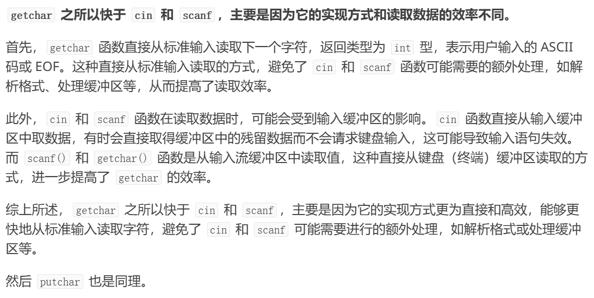

# 针对于整数的 快读快输


## 快读

```C++
int in()
{
    int k=0,f=1;
    char c=getchar();
    while(c<'0'||c>'9')
    {
        if(c=='-'){f=-1
            c=getchar();break;}
        c=getchar();
    }
    if(c<'0'||c>'9')return 0;
    while(c>='0'&&c<='9')k=k*10+c-'0',c=getchar();
    return k*f; // 别忘记标记的负数要乘进去
}
// 调用时用 n=in();

```

## 快输

```C++
void out(int x)
{
    if(x<0)putchar('-'),x=-x;
    if(x<10)putchar(x+'0');
    else out(x/10),putchar(x%10+'0');
}
// 直接调用 out(n) 就行了
```


# 更安全的快读(附加略微性能损失)
避免了  -dasd这种数据的错误读取，但是会有一点性能损失。对于算法竞赛来说这种版本没有必要，一般不会给这种畸形的测试案例


### 代码模版
```c++int read() {
    int x = 0, f = 1;
    char c = getchar();
    while (c < '0' || c > '9') {
        if (c == '-') f = -1;
        c = getchar();
    }
    while (c >= '0' && c <= '9') {
        x = (x << 1) + (x << 3) + (c - '0');
        c = getchar();
    }
    return x * f;
}

```
#### 测试
```c++

int main() {
    int x;
    if (read(&x)) {
        printf("输入的数字是: %d\n", x);
    } else {
        printf("输入无效\n");
    }

    return 0;
}

```
## 原因


