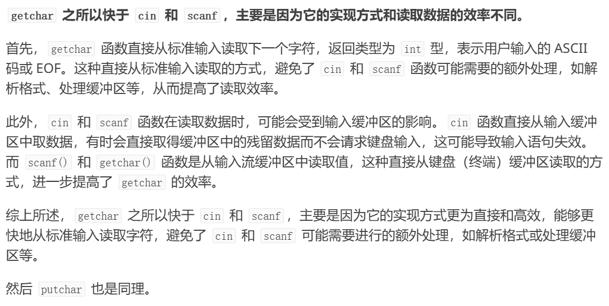

# 针对于整数的 快读快输


## 快读

```C++
int in()
{
    int k=0,f=1;
    char c=getchar();
    while(c<'0'||c>'9')
    {
        if(c=='-')f=-1;
        c=getchar();
    }
    while(c>='0'&&c<='9')k=k*10+c-'0',c=getchar();
    return k*f; // 别忘记标记的负数要乘进去
}
// 调用时用 n=in();

```

## 快输

```C++
void out(int x)
{
    if(x<0)putchar('-'),x=-x;
    if(x<10)putchar(x+'0');
    else out(x/10),putchar(x%10+'0');
}
// 直接调用 out(n) 就行了
```


# 更安全的快读(附加略微性能损失)
避免了  -dasd这种数据的错误读取，但是会有一点性能损失。对于算法竞赛来说这种版本没有必要，一般不会给这种畸形的测试案例


### 代码模版
```c++
#include <stdio.h>
#include <ctype.h>  // 提供 isdigit() 函数

int read(int* x) {
    *x = 0;             // 初始化为 0
    int f = 1;          // 符号位，默认正数
    char ch = getchar(); // 读取第一个字符

    // 跳过所有非数字字符（包括空白符）
    while (ch != '-' && !isdigit(ch)) {
        if (ch == EOF) return 0;  // 遇到 EOF 返回 0 表示失败
        ch = getchar();
    }

    // 检查是否为负数
    if (ch == '-') {
        f = -1;
        ch = getchar();  // 继续读取下一个字符
    }

    // 如果 `-` 后没有数字，返回失败
    if (!isdigit(ch)) return 0;

    // 读取数字部分
    while (isdigit(ch)) {
        *x = *x * 10 + (ch - '0');  // 更新数值
        ch = getchar();
    }

    *x *= f;  // 根据符号位调整正负
    return 1; // 返回 1 表示成功
}

```
#### 测试
```c++

int main() {
    int x;
    if (read(&x)) {
        printf("输入的数字是: %d\n", x);
    } else {
        printf("输入无效\n");
    }

    return 0;
}

```
## 原因


