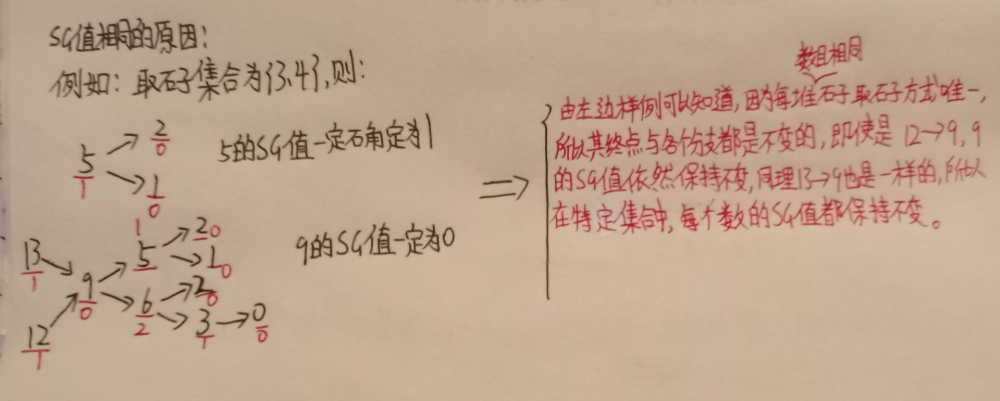

# 公平组合游戏ICG

若一个游戏满足：
1. 有两位玩家交替行动；
2. 在游戏进程的任意时刻，可以执行的合法行动与轮到那位玩家无关；
3. 不能进行移动的玩家判负；  
则称该游戏为一个公平组合游戏

NIM博弈属于公平组合游戏，但城建的棋类游戏，比如围棋，就不是公平组合游戏。

# 常见ICG

## 有向图游戏

在一个有向无环图中，只有一个起点，上面有一个棋子，两个玩家轮流沿着有向边推动棋子，不能走的玩家判负。  
任何一个公平组合游戏都可以转换为有向图游戏。具体方法是：把每个局面看成图中的一个节点，并且从每个局面向沿着合法行动能够到达的下一个局面连有向边。

## Mex运算
设S是一个非负整数集合，定义mex(S)为求出不属于集合S的最小非负整数的运算，即：  
mes(S) = min{x}，x属于自然数，且x不属于S。

## SG函数

在有向图游戏中，对于每个节点 $ x $，设从 $ x $ 出发共有 $ k $ 条有向边，分别到达节点 $ y_1, y_2, ..., y_k $，定义 $ SG(x) $ 为 $ x $ 的后继节点 $ y_1, y_2, ..., y_k $ 的 $ SG $ 函数值构成的集合再执行 $ mex(S) $ 运算的结果，即：
$$
 SG(x) = mex\{SG(y_1), SG(y_2), ..., SG(y_k)\} 
$$
特别地，整个有向图游戏 $ G $ 的 $ SG $ 函数值被定义为有向图游戏起点 $ s $ 的 $ SG $ 函数值，即 $ SG(G) = SG(s) $。

## 有向图游戏的和

设 $ G_1, G_2, ..., G_m $ 是 $ m $ 个有向图游戏，定义有向图游戏 $ G $，它的行动规则是任选某个有向图游戏 $ G_i $，并在 $ G_i $ 上行动一步，$ G $ 被称为有向图游戏 $ G_1, G_2, ..., G_m $ 的和。有向图游戏的和的 $ SG $ 函数值等于各游戏 $ SG $ 函数的异或和，即：
$$
 SG(G) = SG(G_1) \oplus SG(G_2) \oplus ... \oplus SG(G_m) 
$$

### 定理
有向图游戏的某个局面必胜，当且仅当该局面对应节点的 $ SG $ 函数值大于0。  
有向图游戏的某个局面必败，当且仅当该局面对应节点的 $ SG $ 函数值等于0。


```C++
#include<bits/stdc++.h>
using namespace std;

const int N=110,M=10010;
int n,m;
int f[M],s[N];//s存储的是可供选择的集合,f存储的是所有可能出现过的情况的sg值

int sg(int x)
{
    if(f[x]!=-1) return f[x];
    //因为取石子数目的集合是已经确定了的,所以每个数的sg值也都是确定的,如果存储过了,直接返回即可
    set<int> S;
    //set代表的是有序集合(注:因为在函数内部定义,所以下一次递归中的S不与本次相同)
    for(int i=0;i<m;i++)
    {
        int sum=s[i];
        if(x>=sum) S.insert(sg(x-sum));
        //先延伸到终点的sg值后,再从后往前排查出所有数的sg值
    }

    for(int i=0;;i++)
    //循环完之后可以进行选出最小的没有出现的自然数的操作
     if(!S.count(i))
      return f[x]=i;
}

int main()
{
    cin>>m;
    for(int i=0;i<m;i++)
    cin>>s[i];

    cin>>n;
    memset(f,-1,sizeof(f));//初始化f均为-1,方便在sg函数中查看x是否被记录过

    int res=0;
    for(int i=0;i<n;i++)
    {
        int x;
        cin>>x;
        res^=sg(x);
        //观察异或值的变化,基本原理与Nim游戏相同
    }

    if(res) printf("Yes");
    else printf("No");

    return 0;
}
```