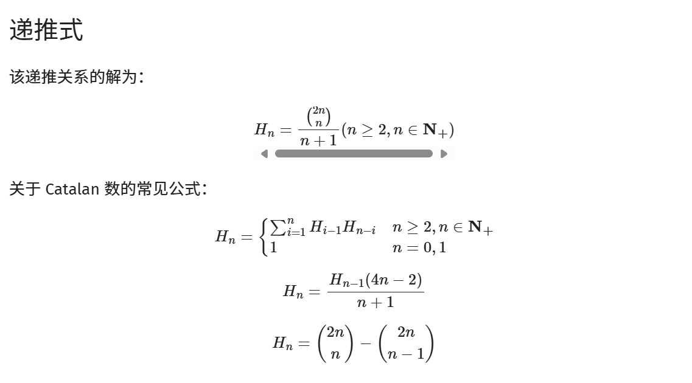

# Catalan 数列

**给定n个0和n个1，它们按照某种顺序排成长度为2n的序列，满足任意前缀中0的个数都不少于1的个数的序列的数量为： Cat(n) = C(2n, n) / (n + 1)**


```c++
 f[0] = 1;
  cin >> n;
  //这里用的第二个公式
  for (int i = 1; i <= n; i++) f[i] = f[i - 1] * (4 * i - 2) / (i + 1);
  ```
## 例题
https://www.luogu.com.cn/problem/P1044


